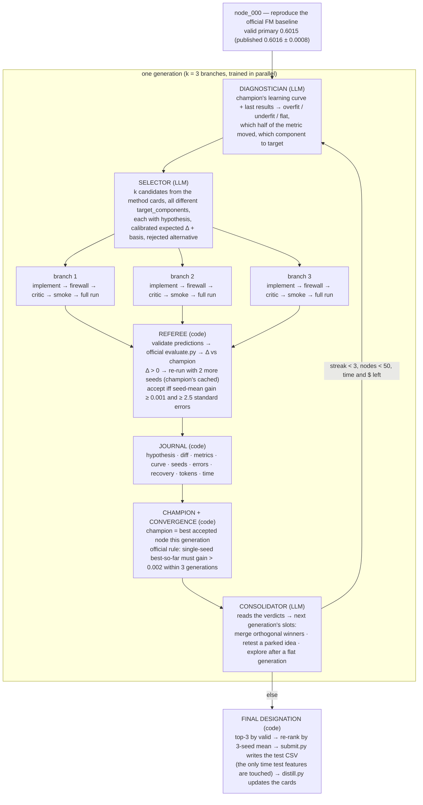

# Harness architecture — the reference (as running in `live_02`)

**In one paragraph.** A deterministic Python loop (`harness/loop.py`) searches a graph of whole training scripts.
Each script is a *node*; each node is scored by a code-only referee with the organizers' untouched `evaluate.py`.
Six LLM roles (`harness/brain.py`, prompts in `harness/prompts.py`) each do exactly one thing inside a node's
creation and never judge a score. Agent scripts run in a workspace that physically contains no test data. Every
node and every generation is journaled in the format the judges asked for. Decisions and their reasons live in
`kb/adr/`; the reasoning behind the design in `kb/APPROACH.md`.

## 1. The loop across nodes — one generation = k branches from the champion



- The next generation branches from the **champion**; losers are not expanded — their ideas are *parked* and may be
  re-proposed on a later champion with a stated reason (ADR-0004).
- A **merge** node has two parents (the graph is a DAG, ADR-0009). Errored branches and crashed generations count
  as non-improving and never stop the run.
- The exploration valve: after a non-improving generation, one slot is forced away from the champion's lineage.

## 2. Inside one branch — the role chain

```mermaid
sequenceDiagram
    participant L as loop.py (code)
    participant I as Implementer (LLM)
    participant F as firewall + diff guard (code)
    participant C as Critic (LLM)
    participant R as referee (code)
    participant X as Fixer (LLM)
    L->>I: candidate + parent script (+ second parent for a merge)
    I-->>L: whole script, edited not rewritten, + change_summary
    L->>F: scan for forbidden paths; count changed lines
    F-->>L: forbidden path → back to Implementer · > 200 changed lines → back to Implementer (once)
    L->>C: script + candidate
    C-->>L: ok | revise (instructions → Implementer, ≤ 2 rounds) | veto (leakage / test access → dropped)
    L->>R: smoke run (SMOKE_EPOCHS=1, 120 s)
    R-->>L: fail → Fixer once → smoke again → fail → node abandoned
    L->>X: error + log tail + script
    X-->>L: patched script + note
    L->>R: full run (30 min timeout, cwd = workspace/, single-threaded BLAS per branch)
    R-->>L: predictions.csv validated (header, count, row_id, alignment, finite) → metrics + learning curve
```

## 3. The roles

| role | receives | returns | model / effort |
|---|---|---|---|
| Diagnostician | champion curve + metrics (GAUC, nDCG@5, ndcg5_disc) + last generation | ≤ 8 lines: dynamics, which metric half moved per node, next probe, overfitting risk | gpt-5.6-sol / medium |
| Selector | diagnosis + cards + facts + journal + consolidator plan + parked ideas | exactly k candidates, distinct components, calibrated expected Δ with a cited basis, cheapest test, rejected alternative | gpt-5.6-sol / high |
| Implementer | one candidate + parent script (+ critic instructions on a revise) | the whole script with only the necessary lines changed | gpt-5.6-sol / high |
| Critic | script + candidate | ok / revise / veto — leakage, contract, scope, noise; terse on ok | gpt-5.6-sol / medium |
| Fixer | failing script + error + log tail | minimal patch + note | gpt-5.6-sol / medium |
| Consolidator | all verdicts of the generation | plan of ≤ k slots: merge / retest / explore | gpt-5.6-sol / medium |

**Context discipline.** The provider `instructions` are a single stable prefix — task spec, scoring, script contract,
measured data facts, all method cards (~12 K tokens) — byte-identical for every role, so the prompt cache serves it
on every call (live_01: 236 K of 370 K input tokens cached). The role text and the dynamic state (champion, curve,
one journal line per node, plan) go in the user message. Never a growing transcript.

## 4. Evaluation and champion selection — all code (`referee.py`, `loop.py`)

1. **Score.** `predictions.csv` is validated against `workspace/data/valid.csv` (header; one row per valid row in
   order; `row_id` 0..N−1; `user_id`/`video_id` identical; finite) and scored with the official `evaluate.py`.
   `ndcg5_disc` (nDCG@5 among users with mixed labels, 1.6× more sensitive) is added as a diagnostic. The script's
   own `metrics.json` is used only for the learning curve.
2. **Delta.** `Δ = node − champion`, the same champion for all branches of a generation.
3. **Acceptance (ADR-0010).** `Δ > 0` → the node is re-run with 2 more seeds (the champion's are cached).
   Accepted iff the difference of seed means ≥ 0.001 **and** ≥ 2.5 standard errors. `Δ ≤ 0` or errored → rejected
   without seeds. Measured reason: the best of k single-seed branches is biased upward — +0.0022 on one seed was
   +0.0017 on three; in live_02 generation 2, three branches at +0.0005/+0.0006/+0.0005 were +0.0000/+0.0001/+0.0002.
4. **Champion.** The accepted node with the highest primary this generation, if it beats the current champion; it
   parents the next generation. Rejected ideas are parked.
5. **Convergence — the organizers' rule, literally.** Per generation: if the best *single-seed* primary exceeds
   best-so-far + 0.002, best-so-far moves and the streak resets; otherwise streak + 1; 3 → converged. Also stops at
   50 nodes (or 50 generations with `--iteration-unit generation`), 6 h, or the dollar budget.
6. **Final designation.** Top-3 nodes by validation primary re-ranked by 3-seed mean; the winner is submitted
   (`submit.py`: one run on `private/test_features.csv`, validated by the organizers' `submit.py --check`; no test
   metric is ever computed).

## 5. Memory across runs (`distill.py`)

After a run, every node that used a card is folded back into it: a `## Measured` line (stack it ran on, single-seed
and seed-mean Δ, verdict, diff size), the `run:node` reference in `evidence`, and `status` = `alive` or
`dead_under {run, stack, delta}`. The next run's Selector reads the cards, so a method dead on one stack can be
argued for a retest only when the stack changes (ADR-0004).

## 6. Counting, budgets, metering

Nodes and generations are both counted (ADR-0006: `--iteration-unit node|generation` decides what the 50 cap
counts). Every LLM call records input, cached, output and reasoning tokens, seconds and response id, attributed to a
node or a generation. `--budget-usd` stops the run on estimated spend. Wall-clock is recorded per node and per run.

## 7. The firewall (ADR-0005)

Agent scripts run with `cwd = workspace/` and `--data-dir workspace/data`: train (all columns), valid (features +
label), the two side tables — never test rows, never the leaky statistic file. Test features live in `private/` and
are read once by `submit.py`. A static scan rejects any script mentioning the raw data directory, the second log
file, the random log, `private/`, `test_features`, the statistic file, or `../` — comments and docstrings included.

## 8. What is journaled (deliverable 3)

`runs/<run_id>/journal.jsonl`: per node — hypothesis, card, `target_component`, parent(s), diff path and size,
expected vs realised Δ, metrics, learning curve, `single_seed_accept`, `seed_confirmation` {seeds, means, Δ, SE, t},
`failure_stage` / `error` / `recovery`, critic rounds, duration, tokens, `intervention`; per generation — diagnosis,
plan, improved, streak, champion, tokens, cost, every LLM call. `summary.json`: stop reason, counts, champion,
designated node with the final ranking, usage, wall-clock, iteration unit. `journal.md` renders it for humans.

## 9. File map

| path | role |
|---|---|
| `harness/config.py` | paths, ε, N, confirmation parameters, caps, forbidden patterns |
| `harness/data_access.py` | builds `workspace/` and `private/` from the raw download (split sizes asserted) |
| `harness/referee.py` | run a script, validate, score, accept, converge |
| `harness/journal.py` | JSONL journal, diffs, markdown |
| `harness/prompts.py` | stable prefix, role prompts, user messages |
| `harness/brain.py` | `Brain` interface, `FakeBrain`, `OpenAIBrain` (GPT-5.6), `AnthropicBrain` |
| `harness/loop.py` | generations, branches, recovery, seed confirmation, champion, convergence, designation |
| `harness/distill.py` | cross-run memory into the cards |
| `harness/submit.py` | final test CSV + official check |
| `harness/cli.py` | `run` / `submit` / `distill` / `report` |
| `harness/seeds/node_000_fm.py` | the baseline under the script contract |
| `workspace/CONTRACT.md` | the interface every node obeys |
| `kb/` | spec, data facts, method cards, literature, ADRs, this document, `APPROACH.md` |
