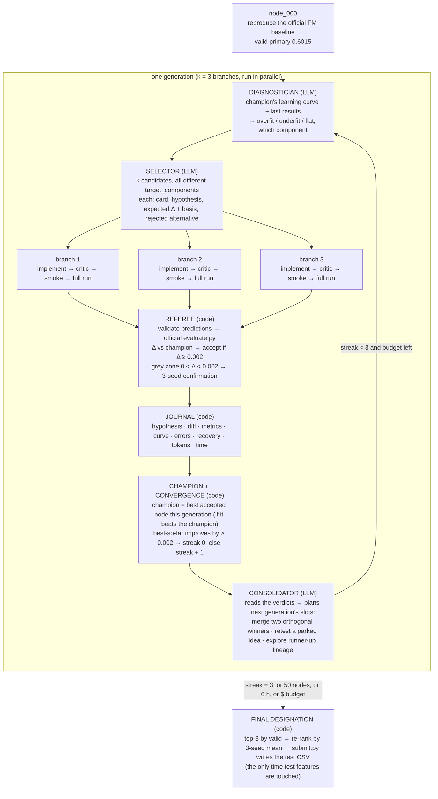
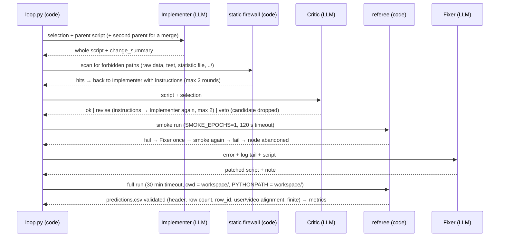

# Harness architecture — the reference

One paragraph: the harness is a **deterministic Python loop** (`harness/loop.py`) that searches over a **graph of
whole runnable scripts**. Each script is a *node*; each node is scored by a **code-only referee** with the
organizers' `evaluate.py`. LLM roles (`harness/brain.py`, prompts in `harness/prompts.py`) do exactly one thing each
inside a node's creation; they never judge scores. Decisions and their reasons are in `kb/adr/`.

## 1. The loop across nodes (one generation = k branches from the champion)

- The next generation always branches from the **champion**; losers are not expanded (their ideas are *parked*
  and may be re-proposed on a later champion with a stated reason — ADR-0004).
- A **merge** node has two parents, so the graph is a DAG rather than a tree (ADR-0009).
- Errored branches count as non-improving; a crashed generation counts as non-improving and never stops the run.

## 2. Inside one branch (the role chain)

Every step is retried at the step where it failed, with a bounded budget; the journal records what failed, what the
Fixer changed, and whether the recovery worked (`failure_stage`, `error`, `recovery`).

## 3. The roles — what each one receives and must return

| role | receives | returns | model / effort |
|---|---|---|---|
| Diagnostician | stable prefix + champion curve + last generation's results | ≤ 8 lines: dynamics, suspected component, what the last generation taught, overfitting risk | gpt-5.6-sol / medium |
| Selector | diagnosis + method menu (cards) + data facts + journal + consolidator plan + parked ideas | exactly k candidates with distinct `target_component`; each with card, hypothesis, `expected_delta` + basis, rejected alternative | gpt-5.6-sol / high |
| Implementer | one candidate + parent script (+ merge parent) (+ critic instructions on a revise round) | the whole script + one-line change summary | gpt-5.6-sol / high |
| Critic | script + candidate | ok / revise (with instructions) / veto, with reasons — leakage, contract, fidelity, noise | gpt-5.6-sol / medium |
| Fixer | failing script + error + log tail | patched whole script + note | gpt-5.6-sol / medium |
| Consolidator | all verdicts of the generation | plan: up to k slots of type merge / retest / explore | gpt-5.6-sol / medium |

The *stable prefix* (task spec, scoring, script contract, measured data facts, method menu) is identical for every
call so the provider's prompt cache serves it; only the role block and the user message change.

## 4. How a node is evaluated and how the champion is chosen (all code, `referee.py` + `loop.py`)

1. **Score.** `predictions.csv` is validated against `workspace/data/valid.csv` (header; exactly one row per valid row,
   in order; `row_id` 0..N−1; `user_id`/`video_id` identical; finite scores) and scored with the untouched official
   `evaluate.py`: GAUC, nDCG@5, primary = their mean. A diagnostic `ndcg5_disc` (nDCG@5 among discriminative
   users) is added because it is 1.6× more sensitive than raw nDCG@5. The script's own `metrics.json` is never trusted
   for the score — only for the learning curve.
2. **Delta.** `Δ = node primary − champion primary` (the champion at the moment of scoring; all branches of a generation
   are compared with the same champion).
3. **Acceptance (ADR-0010).** A candidate whose single-seed Δ is positive is re-run with 2 more seeds (the champion's
   seeds are cached). It is accepted iff the difference of seed means is ≥ 0.001 **and** ≥ 2.5 standard errors.
   Δ ≤ 0 or errored → rejected without extra seeds. Rejected ideas are parked. (Measured reason: the best of k
   single-seed branches is biased upward — live_01's +0.0022 was +0.0017 over three seeds.)
4. **Champion.** After all k branches are scored, the accepted node with the highest primary becomes the champion
   (if it beats the current one). Rejected nodes are parked. The champion is the parent of the next generation.
5. **Convergence.** Per generation: if the generation's best primary exceeds `best-so-far + ε`, best-so-far moves and
   the streak resets; otherwise the streak grows. `streak ≥ 3` → converged. Also stop at 50 nodes, 6 h, the LLM
   dollar budget, or a generation cap.
6. **Final designation.** The top-3 nodes by validation primary are re-ranked by their 3-seed mean; the winner is
   submitted (`harness/submit.py` runs it once on `private/test_features.csv` and validates the CSV with the
   organizers' `submit.py --check`; no test metric is ever computed). This is the AIRA lesson: a single lucky seed
   must not be the submission.

## 5. Counting, budgets, metering

- **Nodes** (every train-and-evaluate cycle) and **generations** are both counted and journaled (ADR-0006). The 50 cap
  applies to nodes; the convergence rule to generations.
- Every LLM call is metered (input, cached, output, reasoning tokens; seconds; response id) and attributed to the node
  (implement / critic / fix) or the generation (diagnose / select / consolidate). Wall-clock is per node and per run.
- `--budget-usd` stops the run when the estimated spend is exceeded.

## 6. The firewall (ADR-0005)

Agent scripts run with `cwd = workspace/` and `--data-dir workspace/data`, which holds train (all columns), valid
(features + label), and the two side tables — never test rows, never the leaky statistic file. Test features live in
`private/` and are read once by `submit.py`. A static scan rejects any script mentioning the raw data directory, the
second log file, the random log, `private/`, `test_features`, the statistic file, or `../`.

## 7. What is journaled (deliverable 3)

`runs/<run_id>/journal.jsonl` — one record per node: hypothesis, method card, `target_component`, parent(s), the code
diff (`diffs/NNN.patch`, line count), expected vs realised Δ, metrics, learning curve, accepted / grey confirmation,
`failure_stage` / `error` / `recovery`, duration, tokens, `intervention`; one record per generation: diagnosis, plan,
improved, streak, champion, tokens, cost, LLM calls; `summary.json` with the stop reason, counts, champion, designated
node and final ranking, usage and wall-clock. `journal.md` renders the same for humans.

## 8. File map

| path | role |
|---|---|
| `harness/config.py` | paths, ε, N, caps, forbidden patterns |
| `harness/data_access.py` | builds `workspace/` and `private/` from the raw download |
| `harness/referee.py` | run a script, validate, score, accept, converge |
| `harness/journal.py` | JSONL journal, diffs, markdown |
| `harness/prompts.py` | stable prefix + role prompts + user messages |
| `harness/brain.py` | `Brain` interface, `FakeBrain`, `OpenAIBrain`, `AnthropicBrain` |
| `harness/loop.py` | generations, branches, recovery, champion, convergence, final designation |
| `harness/submit.py` | final test CSV + official check |
| `harness/cli.py` | `run` / `submit` / `report` |
| `harness/seeds/node_000_fm.py` | the baseline under the script contract |
| `workspace/CONTRACT.md` | the script interface every node obeys |
| `kb/` | spec, data facts, method cards (to come), literature, ADRs |
