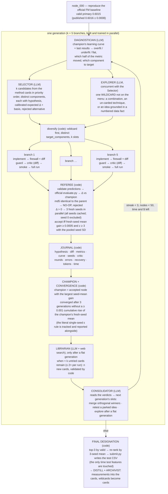

# Harness architecture — the reference (as of ADR-0014; runs `live_07` onward)

**In one paragraph.** A deterministic Python loop (`harness/loop.py`) searches a graph of whole training scripts.
Each script is a *node*; each node is scored by a code-only referee with the organizers' untouched `evaluate.py`.
Nine LLM roles (`harness/brain.py`, prompts in `harness/prompts.py`) each do exactly one thing and never judge a
score: seven inside a generation (Diagnostician, Selector, Explorer, Implementer, Critic, Fixer, Consolidator) and
two that make the knowledge base evolve between generations and runs (Archivist, Librarian). Agent scripts run in
a workspace that physically contains no test data. Every node and every generation is journaled in the format the
judges asked for, and the *exact* journal — every diff included — is in every role's context. Decisions and their
reasons live in `kb/adr/`; the reasoning behind the design in `kb/APPROACH.md`.

## 1. The loop across nodes — one generation = k branches from the champion



- The next generation branches from the **champion**; losers are not expanded — their ideas are *parked* and may be
  re-proposed on a later champion with a stated reason (ADR-0004).
- A **merge** node has two parents (the graph is a DAG, ADR-0009). Errored branches, no-op branches and crashed
  generations count as non-improving and never stop the run.
- The Selector lists k candidates in priority order although it fills k − 1 slots: the last is a reserve used when
  one of its own collides with the Explorer's component (otherwise a generation silently lost a branch).
- **Adaptive breadth.** k = 5 in generation 1, when nothing is measured and breadth pays (live_04: four of five
  accepted), then 3, growing back toward 5 only for the Consolidator's concrete merge/retest slots (live_04's
  later generations: 20 nodes for one hit). `--k` / `--k-later`.
- **Slot rules in code (ADR-0014, after live_06).** From generation 2 one Selector slot is *free*: an untried card
  whose preconditions hold, else a proven card not yet on the champion stack, else a deepen (`_free_slot_ok`, one
  re-ask). Every deepen carries a `mechanism` slug and a `target_group`; a mechanism rejected this run is closed
  (`_closed_mechanisms`), a group with two rejected deepens is hard (`_hard_groups`), and `_apply_rules` drops
  deepens that repeat either. The wildcard must name a `new_signal` absent from the champion's input set
  (`inputs_of`) or it is dropped. The Critic may answer `rebase_to`, and the loop rebuilds the candidate on that
  node's script.
- **Family campaigns (ADR-0016).** From generation 2 code picks one card family per generation
  (`_campaign_family`: a measured screen gain of its cards first, else the highest card promise still measurable on
  this stack; ensembling last); every Selector candidate except Consolidator merge/retest slots and the wildcard
  belongs to it, `_diversify` keeps one candidate per *mechanism* inside it, and `_campaign_update` closes the family
  after `CAMPAIGN_FLAT_GENERATIONS` flat generations with its evidence in `state['families']`. `--no-campaigns`
  restores breadth generations.

- **The feature screen (ADR-0015, during live_07).** A feature / encoding / history candidate, and any wildcard naming a
  `new_signal`, is probed before it is built: a Probe-role script computes the signal for the valid rows on a data dir whose
  `valid.csv` has every outcome column stripped, and `screen.py` measures within-user `varies`, standalone GAUC, the additive
  gain on the champion's predictions and a lambdarank stack gain. Below `SCREEN_MIN_GAIN` (0.0003) the slot is dropped and
  journaled (`action: screen`); the planners see "Screened this run". Measured basis: every item-statistic / session /
  exposure-context feature scored <= +0.0005 on the FM champion (`kb/data/screens/`).

## 2. Inside one branch — the role chain

```mermaid
sequenceDiagram
    participant L as loop.py (code)
    participant I as Implementer (LLM)
    participant F as firewall + diff guard (code)
    participant C as Critic (LLM)
    participant R as referee (code)
    participant X as Fixer (LLM)
    L->>I: candidate (hypothesis FIXED) + parent script + the parent's actual stack + same-component history
    I-->>L: whole script, edited not rewritten, + change_summary
    L->>F: scan for forbidden paths; count changed lines
    F-->>L: forbidden path → back to Implementer · > 200 changed lines → back to Implementer (once)
    L->>C: candidate + UNIFIED DIFF + parent docstring + parent stack + full script
    C-->>L: ok | revise (code changes only, ≤ 2 rounds) | veto (leakage / test access → dropped)
    L->>R: smoke run (SMOKE_EPOCHS=1, 120 s)
    R-->>L: fail → Fixer once → smoke again → fail → node abandoned
    L->>X: error + log tail + script
    X-->>L: patched script + note
    L->>R: full run (30 min timeout, cwd = workspace/, BLAS threads pinned per branch)
    R-->>L: predictions.csv validated (header, count, row_id, alignment, finite) → metrics + curve + md5
```

The five chains run in parallel threads; every LLM call is tagged with its node so tokens are attributed per node.
The Critic reviews code only: the hypothesis is fixed (it never argues that an idea is not worth testing — the
referee measures that), and it judges scope from the diff against the parent's *actual* stack, so a card marked
"proven" in an earlier run can no longer be smuggled into a candidate that did not ask for it (ADR-0012).

## 3. The roles

| role | receives | returns | model / effort |
|---|---|---|---|
| Diagnostician | champion curve + metrics (GAUC, nDCG@5, ndcg5_disc) + last generation | ≤ 8 lines: dynamics, which metric half moved per node, next probe, overfitting risk | gpt-5.6-sol / medium |
| Selector | diagnosis + cards + facts + full journal + consolidator plan + parked ideas + the ADR-0014 state (untried cards, proven cards not on the stack, closed mechanisms, hard groups, champion inputs) | k candidates in priority order, distinct components, the free slot first from generation 2, `mechanism` + `target_group` on deepens, calibrated expected Δ with a cited basis, cheapest test, rejected alternative | gpt-5.6-sol / xhigh |
| Probe | the candidate (card, hypothesis, new_signal), the champion's input set, the data files of the probe dir, the method card | a short standalone script writing `features.csv` (row_id + <= 8 numeric columns aligned to valid) — the signal, not the model | gpt-5.6-sol / medium |
| Explorer | the same, plus the list of card ids | one off-menu candidate, same schema plus `new_signal` (an input the champion does not read), flagged WILDCARD | gpt-5.6-sol / xhigh |
| Implementer | one candidate + parent script + parent stack + same-component history (+ critic instructions on a revise) | the whole script with only the necessary lines changed | gpt-5.6-sol / xhigh |
| Critic | candidate + unified diff + parent docstring/stack + script | ok / revise / veto — leakage, contract, scope, information (wildcards), library determinism; `rebase_to` when the diff is against the wrong parent; terse on ok | gpt-5.6-sol / medium |
| Fixer | failing script + error + log tail | minimal patch + note | gpt-5.6-sol / medium |
| Consolidator | all verdicts of the generation | plan of ≤ k slots: merge / retest / explore | gpt-5.6-sol / medium |
| Archivist | a measured wildcard: record + diff + run journal + card schema | a new card (or `duplicate_of` an existing one) | gpt-5.6-sol / medium |
| Librarian | menu with statuses + run journal + web search | n new `untried` cards with sources | gpt-5.6-sol / high + `web_search` |

**Context discipline — nothing summarised, everything cached.** The provider `instructions` are two blocks:
(1) the *stable prefix* — task spec, scoring, **foundations** (the task-specific mathematics, ADR-0013), script
contract, measured data facts, the card status table and all cards (≈ 17 K tokens), byte-identical for every role
and generation; (2) the *run block* — `Journal.digest()`, the exact record of every node so far, frozen at the start
of the generation, with full diffs for the champion lineage, accepted nodes and the last generation and 10-line
stubs for older rejected nodes. The run block goes only to the roles that plan (Diagnostician, Selector, Explorer,
Consolidator, Librarian, Archivist — four or five calls per generation); the Implementer receives the diffs of the
nodes relevant to its component in its own message and the Critic reviews a diff and needs no journal, so the
block does not multiply the input-token count the organizers tier Feasibility on. Both blocks are served by the
prompt cache after the first call of a generation (live_02: 682 K of 866 K input tokens cached); the summary
reports cached and uncached input separately. The role text and the per-call state go in
the user message. Never a growing transcript. The rules the roles read are generated from `config.py`
(`rules_text()`), so the text cannot drift from the code (ADR-0012).

## 4. Evaluation, champion, convergence — all code (`referee.py`, `loop.py`)

1. **Score.** `predictions.csv` is validated against `workspace/data/valid.csv` (header; one row per valid row in
   order; `row_id` 0..N−1; `user_id`/`video_id` identical; finite) and scored with the official `evaluate.py`;
   `ndcg5_disc` (nDCG@5 among users with mixed labels) is added as a diagnostic; the file's md5 is kept.
2. **Delta.** `Δ = node − champion`, the same champion for all branches of a generation.
3. **No-op.** Predictions byte-identical to the parent's → the change did nothing; rejected without seeds and
   labelled NO-OP for the Diagnostician and Consolidator (live_04 had two such nodes scored as experiments).
4. **Acceptance (ADR-0010/0011/0012).** `Δ > 0` on seed 0 → the node is re-run with **three fresh seeds** (every
   seed of every node is cached once, `state.seed_cache`); seed 0 is the selected screen and is excluded from the
   means. Accepted iff the difference of fresh-seed means ≥ 0.0005 **and** z ≥ 3.0, where z uses the seed SD pooled
   over every fresh-seed run of the run (prior 0.0003 at 4 df) — a z-test, not a 2-df t-test; a borderline
   2.0 ≤ z < 3.0 gets two more seeds first. Two-sample, because seeds are not paired across different scripts.
   Measured reason: the best of k single-seed branches is biased upward — +0.0022 on one seed was +0.0017 on three;
   +0.0005/+0.0006/+0.0005 were +0.0000/+0.0001/+0.0002; the old t-test passed 3–6 % of null candidates.
5. **Champion (ADR-0012).** The accepted node with the largest seed-mean gain this generation; it parents the next
   generation. A rejected node's lucky single seed cannot block it. Rejected ideas are parked.
6. **Convergence (ADR-0012, revised).** The streak resets when the champion's fresh-seed mean has risen by at least
   0.001 since the last reset (cumulative, like `min_delta` against the best seen: ε/2 on a statistic with a third
   of the noise — one false acceptance cannot buy three generations, a staircase of real gains counts); three
   generations without such a rise → converged. Smaller confirmed gains still move the champion. ε remains the per-node single-seed screen; `referee.OfficialRule` tracks the literal
   rule (single-seed best, > ε, N = 3) every generation, and the summary reports where it would have stopped and
   which node it would have submitted (`--convergence official` makes it the stopping rule). Also stops at 50 nodes (or 50 generations with
   `--iteration-unit generation`), 6 h of running time, or the dollar budget.
7. **Final designation.** Top-3 nodes by validation primary re-ranked by 3-seed mean; the winner is submitted
   (`submit.py`: one run on `private/test_features.csv`, validated by the organizers' `submit.py --check`; no test
   metric is ever computed).

## 5. Memory across runs and the evolving menu (`distill.py`, `librarian.py`, ADR-0004/0013)

When a run ends: **distill** folds every card-node into its card — a `## Measured` line (stack, single-seed and
seed-mean Δ, t, verdict, diff size, NO-OP), the `run:node` reference, and a `status` aggregated over all stacks
(`proven — accepted on [stack]` · `dead_under [stack ×N (best Δ)]` · `untried`) with a one-line verdict; the
**Archivist** turns every measured wildcard into a new card written from its actual diff (code fixes status,
evidence and the measurement; the validator gates it); a Selector deepen named `<card id> — <variant>` is filed as a
measurement of the base card with the variant text, not as a card (ADR-0014). The **Librarian** adds web-searched cards after flat
generations and on demand. The next run's Selector opens with the status table, so a method dead on one stack can
be argued for a retest only when the stack changes, and yesterday's wildcard is today's menu item.

## 6. Counting, budgets, metering

Nodes and generations are both counted (ADR-0006: `--iteration-unit node|generation` decides what the 50 cap
counts). Every LLM call records input, cached, output and reasoning tokens, web searches, seconds and response id,
attributed to a node or a generation. `--budget-usd` stops the run on estimated spend. Wall-clock is recorded per
node and per run and survives resumes.

## 6a. Calibrated cards and the family ledger (ADR-0018)

`distill.calibrate()` runs at the end of every distill: a card with measurements gets `expected_delta = [0, max
measured seed-mean gain]` (0 if never positive); an unmeasured card whose signal family has an oracle bound
(`kb/methods/family_bounds.json`, from facts §11) is capped at the bound; every bounded card carries a
`ceiling:oracle` Measured line. Variants of a card are Measured lines on it, not new cards (the Archivist answers
`duplicate_of`; `MEASURED_RE` accepts `(variant: …)`). The Selector's parser validates card ids (one format
reminder, then flagged). `kb/methods/ledger.py` generates `families.json` — per signal family the bound, screen
gains, measured nodes, best measured gain and status — which `_family_score` reads to order campaigns.

## 6b. Libraries and determinism (ADR-0014)

Agent scripts may import numpy, pandas, scikit-learn, LightGBM and PyTorch (CPU); `config.AVAILABLE_LIBS` and
`libs_text()` generate the sentence every role reads, and `workspace/CONTRACT.md` states the rules: CPU only, thread
count from `OMP_NUM_THREADS` (the runner sets it to `cores // k` per branch), every library seeded from `--seed`,
`SMOKE_EPOCHS` capping boosting rounds too, the learning curve still required. The Critic checks these; the seed
confirmation catches what it misses (a non-deterministic script cannot pass a fresh-seed z-test by accident twice).
`tests/test_rules_adr0014.py` runs LightGBM + torch under the runner twice and asserts identical predictions.

## 6c. The feature screen (ADR-0015)

`harness/screen.py` (no LLM). `probe_data_dir()` builds `workspace/data_probe/` (links + a label-stripped `valid.csv`);
`run_probe(code, out_dir, champion_predictions, threads)` runs the probe under the firewall and the thread env with a 180 s cap,
validates `features.csv` (alignment, finiteness, <= 8 columns) and returns a `ScreenResult` with per-column `varies` / `gauc` /
`additive` and a `stack_gain`; `passes(res)` is the gate (`best_gain >= SCREEN_MIN_GAIN`; a failed screen never blocks).
`Loop._screen` runs the probes in parallel after `_diversify`, journals every verdict, extends `state['screened']`
(`generation, card, family, best_gain, kept` — the campaign planner of ADR-0016 reads `family` and `best_gain`), and drops the
failing slots. `--no-screen` turns it off; a brain without a `probe` role (the FakeBrain) never screens.

## 7. The firewall (ADR-0005)

Agent scripts run with `cwd = workspace/` and `--data-dir workspace/data`: train (all columns), valid (features +
label), the two side tables — never test rows, never the leaky statistic file. Test features live in `private/` and
are read once by `submit.py`. A static scan rejects any script mentioning the raw data directory, the second log
file, the random log, `private/`, `test_features`, the statistic file, or `../` — comments and docstrings included.
Web content reaches the harness only as cards written by the Librarian: every idea still passes the firewall, the
Critic and the referee.

## 8. What is journaled (deliverable 3)

`runs/<run_id>/journal.jsonl`: per node — hypothesis, card, `target_component`, `wildcard`, parent(s), diff path
and size, expected vs realised Δ, metrics, learning curve, `pred_hash` / `identical_to_parent`,
`single_seed_accept`, `seed_confirmation` {seeds, means, Δ, SE, t}, `failure_stage` / `error` / `recovery`, critic
rounds, duration, tokens, `intervention`; per generation — diagnosis, plan, improved, streak, champion, best,
tokens, cost, every LLM call; events (librarian, crashes). `summary.json`: stop reason, counts, champion and its
seed-mean, best single seed, designated node with the final ranking, usage, wall-clock, iteration unit.
`journal.md` renders it for humans; `Journal.digest()` renders it for the roles.

## 9. File map

| path | role |
|---|---|
| `harness/config.py` | paths, ε, N, confirmation parameters, caps, forbidden patterns, `rules_text()` |
| `harness/data_access.py` | builds `workspace/` and `private/` from the raw download (split sizes asserted) |
| `harness/referee.py` | run a script, validate, score, hash, single-seed screen, `Convergence` |
| `harness/journal.py` | JSONL journal, diffs, `digest()` for the roles, markdown for humans |
| `harness/prompts.py` | stable prefix, run block, role prompts, user messages |
| `harness/brain.py` | `Brain` interface, `FakeBrain`, `OpenAIBrain` (GPT-5.6, web search), `AnthropicBrain` (kept, not exercised in the reported runs) |
| `harness/loop.py` | generations, branches, recovery, seed confirmation, champion, convergence, designation |
| `harness/distill.py` | measurements into the cards; the Archivist |
| `harness/librarian.py` | the Librarian (web-searched cards) |
| `harness/submit.py` | final test CSV + official check |
| `harness/cli.py` | `run` / `submit` / `distill` / `librarian` / `report` |
| `harness/seeds/node_000_fm.py` | the baseline under the script contract |
| `workspace/CONTRACT.md` | the interface every node obeys |
| `kb/` | spec (+ foundations), data facts, method cards, literature, ADRs, this document, `APPROACH.md` |
